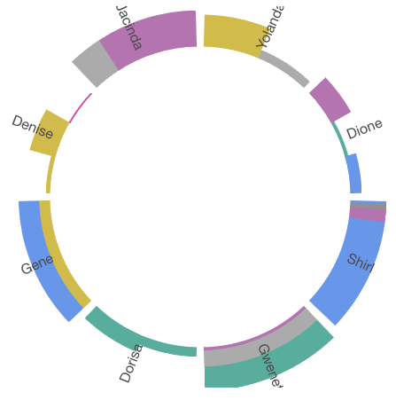

# A Gear-style Chart Component for React



[Demo](https://noru.github.io/react-gear-chart/storybook-static/index.html)

## Install

```
npm install react-gear-chart
```

## Usage

```javascript
import GearListChart from 'react-gear-chart'

// in your render() or whatever
<GearListChart 
  startAngle={110} endAngle={250} 
  outerRadius={300} innerRadius={200}
  margin={7}
  onClick={yourClickHandler}
  clockwise={false}
  items={items} // items to be rendered as teeth on the gear
  />
```

## Props

Name | Type |Default| Description
--------- | ---- | ------|-----------
startAngle | `number`| | **Required**. Start angle of your chart in degree with [this convention](https://en.wikipedia.org/wiki/Polar_coordinate_system#/media/File:Polar_graph_paper.svg)
endAngle | `number` | | **Required**. End angle of your chart.
innerRadius | `number` | | **Required**. Inner radius of your chart in pixel.
outerRadius | `number` | | **Required**. Outer radius of your chart in pixel.
items | `Array<ToothOption> | | **Required**. Chart data. See [Strip](#ToothOption)
margin | `number` | 0 | Default angle between teeth.
mode | `string` | 
clockwise | `boolean` | true | The line-up direction of your items(teeth).
clockwiseAnimate | `boolean` | true | Teeth In/out animation direction. 
motionConfig | `object` | {} | Config for react-motion. See [SpringHelperConfig](https://github.com/chenglou/react-motion#helpers)
onClick | `function` | | `click` event handler. Strip data is passed with the event, access it by `evt.stripData` & `evt.strips`
onMouseMove/Leave/Enter/Over | `function` | | Similar to prop `onClick`


### ToothOption

ToothOption is a configuration object with following properties

Name | Type |Default| Description
--------- | ---- | ------|-----------
mode | `string` | `spokerib` | `spokerib`, `layer` or `bar`. See [demo](https://github.build.ge.com/pages/foundry-sh/dew-gear-chart/storybook-static/index.html) for details
label | `string` | | Text to show on a tooth
strips | `object` or `array` | | See [StripOption](#StripOption). Can be a single `StripOption` or an array of `StripOption`

### StripOption

StripOption is a configuration object with following properties

Name | Type |Default| Description
--------- | ---- | ------|-----------
color | `string` |  | Valid css color, to fill current strip. 
weight | `nubmer` | | Alone with the tooth height (outerRadius - innerRadius), determine the "size" of the current strip, like bar height, or Annulus portion in different mode. 

**Note: other properties can be attached to ToothOption/StripOption and accessed n every mouse event hanlder from the event object.**